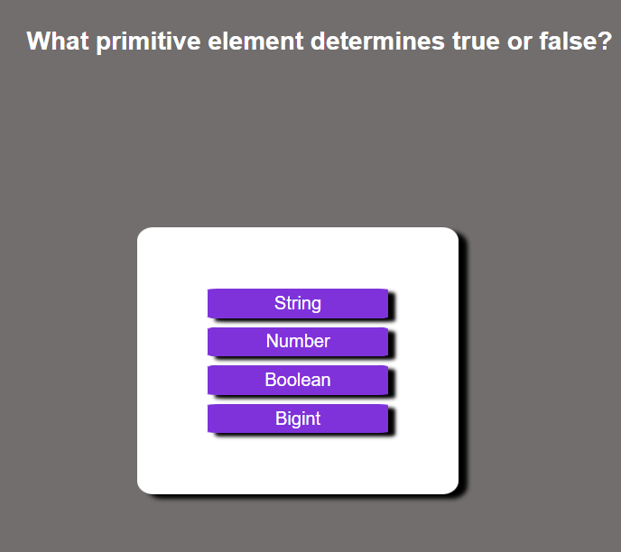

# 04 Web APIs: Code Quiz

## Description

This assignment required me to create a coding quiz with multiple choice questions that display dynamically using javascript.

## Tasks 

- Created a webpage that dynamically displayed text using javascript.
- Included a timer that would decriment by 5 seconds for wrong answers.
- Included a score keeper that pulled data from local storage to keep the last score.
-   when the game is won or lost it allows the user to input their initials and displays their score.

## Usage

## Links
Deployed Webpage: https://rambriz91.github.io/Quizer-App/
GitHub Repo Page: https://github.com/rambriz91/Quizer-App

## Credits

- https://www.youtube.com/watch?v=riDzcEQbX6k
- https://www.codeinwp.com/snippets/add-event-listener-to-multiple-elements-with-javascript/https://-   developer.mozilla.org/en-US/docs/Web/JavaScript/Reference/Operators/Decrement
- https://www.w3schools.com/jsref/met_win_cleartimeout.asp#:~:text=The%20clearTimeout()%20method%20clears,with%20the%20setTimeout()%20method.
- https://developer.mozilla.org/en-US/docs/Web/API/HTMLElement/innerText

## License

MIT License

Copyright (c) [2023] [Robert Ambriz]

Permission is hereby granted, free of charge, to any person obtaining a copy
of this software and associated documentation files (the "Software"), to deal
in the Software without restriction, including without limitation the rights
to use, copy, modify, merge, publish, distribute, sublicense, and/or sell
copies of the Software, and to permit persons to whom the Software is
furnished to do so, subject to the following conditions:

The above copyright notice and this permission notice shall be included in all
copies or substantial portions of the Software.

THE SOFTWARE IS PROVIDED "AS IS", WITHOUT WARRANTY OF ANY KIND, EXPRESS OR
IMPLIED, INCLUDING BUT NOT LIMITED TO THE WARRANTIES OF MERCHANTABILITY,
FITNESS FOR A PARTICULAR PURPOSE AND NONINFRINGEMENT. IN NO EVENT SHALL THE
AUTHORS OR COPYRIGHT HOLDERS BE LIABLE FOR ANY CLAIM, DAMAGES OR OTHER
LIABILITY, WHETHER IN AN ACTION OF CONTRACT, TORT OR OTHERWISE, ARISING FROM,
OUT OF OR IN CONNECTION WITH THE SOFTWARE OR THE USE OR OTHER DEALINGS IN THE
SOFTWARE.